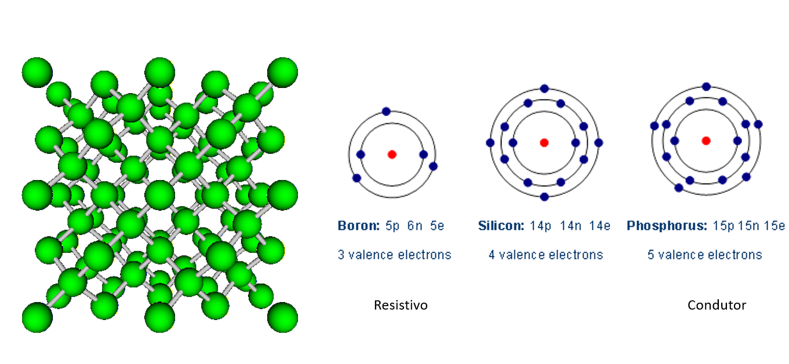
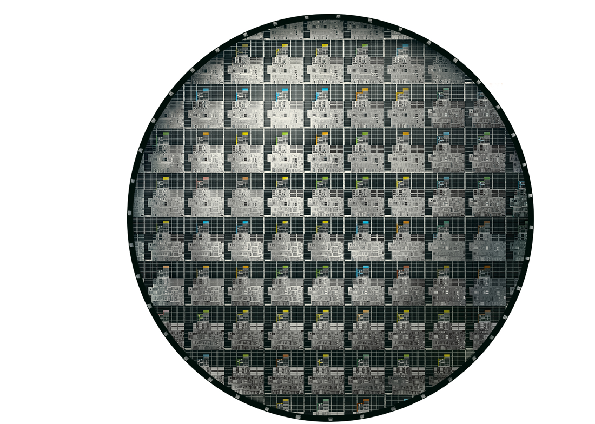
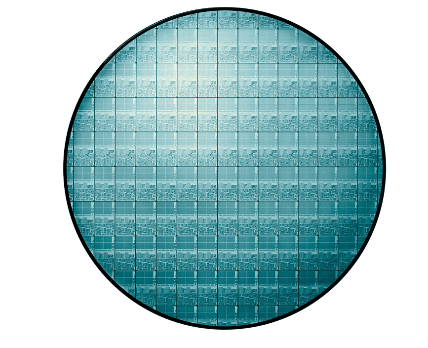
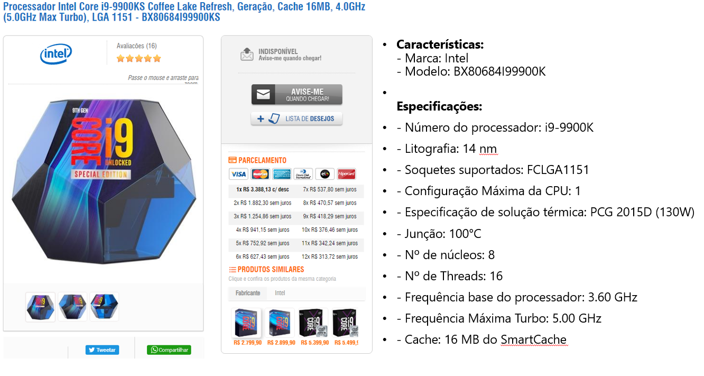

# Aula de Processadores

## Fabricação e Características do Silício

O silício é a base fundamental para a construção de processadores. Abaixo estão os principais pontos sobre sua obtenção e características físicas:

*   **Matéria-prima:** A base do silício é a areia, mais especificamente o Dióxido de Silício ($SiO_2$).
*   **Temperatura de processamento:** Para a purificação e criação dos lingotes, o material é fundido a temperaturas altíssimas, em torno de **1400°C**.
*   **Lâminas de Silício (Wafers):** O silício purificado é fatiado em lâminas redondas. Como referência de custo, uma lâmina de 3 polegadas custa em média 13 dólares.
*   **Perfeição Estrutural:** O silício monocristalino é considerado um dos materiais mais perfeitos já fabricados. A sua rede de átomos é tão bem organizada que, se a lâmina quebrar, a fratura segue uma linha reta perfeitamente lisa, dando a impressão de que os próprios átomos foram cortados.
*   **Ambiente de Fabricação:** A construção de chips requer obrigatoriamente o uso de uma **sala limpa** (cleanroom). Esses ambientes controlam rigorosamente a quantidade de partículas no ar, pois um simples grão de poeira é gigante em comparação aos transistores e pode arruinar o chip.

---

## Estrutura Cristalina e Dopagem (Análise da Imagem)

A imagem acima ilustra os conceitos de rede cristalina e como os materiais se comportam ao nível atômico, o que é essencial para o funcionamento dos processadores:

1.  **Rede Cristalina (Esquerda):** A estrutura verde representa a organização tridimensional dos átomos de silício. Essa ligação covalente rígida e perfeitamente ordenada é o que confere a estabilidade e a propriedade de quebrar em linha reta.
2.  **Átomo de Silício (Centro):** O Silício puro (intrínseco) possui **4 elétrons de valência** na sua última camada (total de 14 prótons, 14 nêutrons e 14 elétrons). Isso permite que ele se ligue perfeitamente a outros 4 átomos de silício.
3.  **Dopagem com Boro (Esquerda do Silício):** O Boro tem apenas **3 elétrons de valência**. Quando inserido na estrutura do silício, falta um elétron para completar a ligação, gerando o que chamamos de "lacuna" (ou buraco). A anotação na imagem o define como **Resistivo** (Dopagem Tipo P).
4.  **Dopagem com Fósforo (Direita):** O Fósforo possui **5 elétrons de valência**. Ao ser inserido no meio do silício, 4 elétrons formam ligações, deixando 1 elétron sobrando e livre para se movimentar pelo material. Isso aumenta bastante a condutividade elétrica, sendo anotado na imagem como **Condutor** (Dopagem Tipo N).

Através da combinação desses materiais dopados, é possível criar transistores, que são a base de qualquer processador moderno.

## O Wafer e a Separação dos Chips (Dies)

A imagem `img2_chip.png` ilustra uma lâmina de silício (wafer) já processada, contendo dezenas de circuitos impressos na sua superfície antes do corte final.

*   **Definição de "Die":** A pronúncia "dai" refere-se à palavra em inglês **Die**. Após o wafer receber a gravação dos transistores, ele é fatiado. Cada um dos retângulos ou quadrados individuais cortados da lâmina principal, que compõe o chip final do processador, recebe o nome de *die*.
*   **Descartes (O que vai para o lixo):** Como o wafer é circular e os *dies* são retangulares, há uma incompatibilidade geométrica. Os circuitos impressos nas bordas do círculo ficam incompletos. Esses recortes das extremidades, assim como os *dies* centrais que falham na etapa de testes elétricos, são descartados e não seguem para o empacotamento final.

*   **Chip defeituoso ou cortado:** Não pode ser "derretido" e transformado em um novo processador. Uma vez que o wafer de silício passa pelo processo de gravação, sua estrutura é alterada de forma irreversível.

*   **Identificação Visual da Cache:** As áreas frequentemente vistas como blocos escuros, grandes e com um padrão denso e repetitivo representam a **Memória Cache**. A memória é formada por células idênticas (SRAM) que se repetem milhares de vezes, criando esse aspecto visual uniforme no silício. As partes com aparência mais "bagunçada" são os circuitos lógicos de processamento.
*   **Cache L1 (Level 1):** É a memória mais próxima do núcleo do processador. É a menor em capacidade de armazenamento, porém a mais rápida do sistema. Ela alimenta o processador imediatamente com os dados essenciais.
*   **Cache L2 (Level 2):** Fica localizada "em volta" ou logo após a L1 (as áreas escuras mencionadas na aula). Ela tem uma capacidade maior que a L1, mas é ligeiramente mais lenta. Serve como um estoque intermediário para garantir que a L1 e os núcleos não fiquem sem dados para processar.

### Processador Xeon

* Tem cache L1 e L2 também

## Tipos de encapsulamentos CIs

Após o corte da lâmina de silício, os *dies* (chips) precisam ser preparados para se conectarem à placa-mãe. Esse processo de conexão e proteção é chamado de encapsulamento.

*   **Do Wafer para o Encapsulamento:** O material redondo que é cortado é o próprio **wafer** (ou lâmina de silício). Cada *die* retirado dele recebe microconexões.
*   **O Uso do Ouro:** Os contatos do chip recebem ouro puro (24 quilates). A pureza é fundamental porque impurezas aumentam a resistência elétrica, o que geraria mais calor e perda de eficiência. O ouro é escolhido por ser extremamente maleável e não oxidar.
    *   *Curiosidade sobre e-waste:* No início dos anos 90, uma tonelada de processadores antigos rendia até 95 gramas de ouro. Hoje, com a miniaturização e processos mais eficientes, esse número caiu para cerca de 60 a 65 gramas por tonelada.
*   **Processo de Soldagem e Conexão:** O chip cortado é fixado a um substrato (uma plaquinha verde que forma a base do processador). As máquinas que fazem a micro-soldagem (muitas vezes usando agulhas de plástico modernas em vez de metal para evitar danos ao silício) conectam os minúsculos pontos de ouro do *die* aos contatos correspondentes no substrato.
*   **Fechamento e Proteção:** Para fechar e proteger o delicado chip de silício (a parte que ficou em branco nas suas anotações), é injetada uma **resina epóxi** de alta resistência. Em processadores de desktop, também é colada uma tampa metálica por cima, chamada de **IHS (Integrated Heat Spreader)**, que protege o *die* e ajuda a dissipar o calor para o cooler.
*   **Das "Perninhas" para as "Bolinhas":** 
    *   Antigamente, os processadores usavam o padrão **PGA (Pin Grid Array)**, cheio de "perninhas" (pinos) frágeis que entortavam fácil.
    *   Hoje, a indústria migrou para contatos mais eficientes: o **BGA (Ball Grid Array)**, que usa pequenas esferas de solda (as "bolinhas") derretidas diretamente na placa; e o **LGA (Land Grid Array)**, onde o processador tem apenas contatos chatos e dourados, e os pinos ficam no soquete da placa-mãe. É através desses minúsculos contatos que toda a energia e transferência de dados ocorrem.

## Evolução dos processadores 
Junto com as anotações sobre dimensões e métricas de desempenho.
| Modelo                  | Ano          | Frequência        | Número de Transistores | Dimensões       | Poder de Processamento                        | Tensão |
| :---------------------- | :----------- | :---------------- | :--------------------- | :-------------- | :-------------------------------------------- | :----- |
| Pentium 3               | 1999 – 2002  | 550 MHz – 1 GHz   | 10 M – 100 Milhões     | 230 nm – 130 nm | 5 GOPS                                        | 1,8 V  |
| Pentium 4               | 2002 – 2006  | 1,2 GHz – 3,6 GHz | 100 M – 280 Milhões    | 130 nm – 90 nm  | 9 GOPS                                        | 1,5 V  |
| Core 2 Duo              | 2007 - 2012  | 1,2 GHz – 3,3 GHz | 600 Milhões            | 65 nm – 32 nm   | 23 GOPS                                       | 1,2 V  |
| Atuais (i3, i5, i7, i9) | 2010 – atual | 1,6 GHz – 5,0 GHz | 1,5 Bilhões            | 28 nm – 5 nm    | i3 – 50 GOPS i5 – 80 GOPS i7 – 120 GOPS | 0,81 V |

**Comparações de Escala e Dimensões**
*   **Fio de cabelo:** 70 a 100.10^-6 m
*   **100 nm:** 100.10^-9 m
*   **7 nm:** 7.10^-9 m

**Métricas de Desempenho**
*   **GIPS:** Bilhões de instruções por segundo
*   **GFLOPS:** Bilhões de operações de ponto flutuante por segundo
*   **GOPS:** Bilhões de operações por segundo (GIPS+GFLOPS)/2
  

